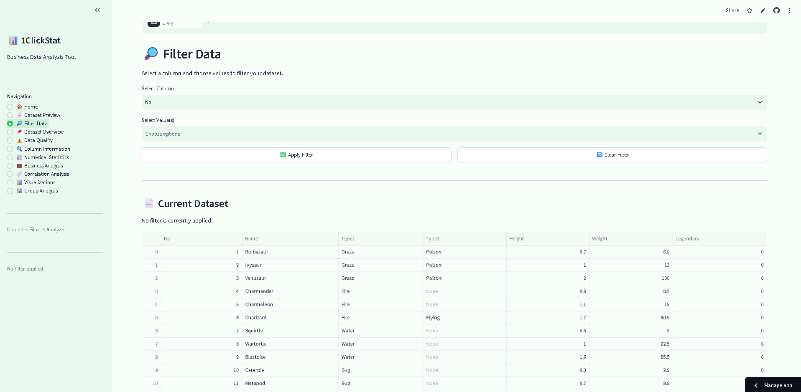

# 📊 1ClickStat

> **One-click business data analysis with filters, insights, statistics, and visualizations.**

1ClickStat is a simple and powerful **business data analysis tool** built with Streamlit. Upload your dataset and explore useful insights, statistics, business metrics, filters, correlations, and visualizations — all in one place.



---

## ✨ Features

### 📂 Dataset Upload

Upload and analyze datasets in multiple formats:

- CSV
- Excel (`.xlsx`)
- JSON

---

### 📄 Dataset Preview

Quickly explore your uploaded dataset with an interactive data table.

You can easily:

- View your data
- Explore columns
- Sort data
- Inspect rows

---

### 🔎 Data Filtering

Filter your dataset by:

- Selecting a column
- Selecting one or multiple values

The filtered dataset is then used for analysis, making it easy to explore specific parts of your business data.

---

### 📌 Dataset Overview

Get a quick overview of your dataset including:

- Total rows
- Total columns
- Numerical columns
- Categorical columns

---

### ⚠️ Data Quality Analysis

Identify potential data problems such as:

- Missing values
- Duplicate rows
- Missing values by column

This helps businesses quickly understand the quality of their data.

---

### 🔍 Column Information

Explore useful information about every column:

- Column name
- Data type
- Non-null values
- Unique values

---

### 📈 Numerical Statistics

Analyze numerical data with important statistical metrics:

- Sum
- Average / Mean
- Median
- Mode
- Minimum
- Maximum
- Standard Deviation
- Variance
- Count

Useful for analyzing business metrics such as sales, revenue, profit, expenses, and more.

---

### 💼 Business Analysis

Perform business-focused calculations to answer questions like:

- Which year had the highest sales?
- Which category generated the most revenue?
- What is the total sales amount?
- What is the average profit?
- Which row contains the maximum value?
- Which row contains the minimum value?

---

### 👥 Group Analysis

Analyze a numerical column grouped by another column.

For example:

- Sales by Year
- Revenue by Category
- Profit by Region
- Orders by Product Type

Supported operations include:

- Sum
- Mean
- Count
- Minimum
- Maximum

---

### 🔗 Correlation Analysis

Explore relationships between numerical columns using correlation analysis.

This can help identify connections between metrics such as:

- Sales and Profit
- Revenue and Expenses
- Quantity and Revenue

---

### 📊 Automatic Visualizations

1ClickStat automatically generates useful charts for your dataset.

#### Numerical Data

- Distribution charts
- Histograms

#### Categorical Data

- Bar charts
- Category distributions

Charts are displayed in a clean **2-column layout** for easier exploration.

---

## 🛠️ Built With

- 🐍 Python
- 🌐 Streamlit
- 🐼 Pandas
- 📊 Matplotlib
- 📗 OpenPyXL

---

## 🚀 Getting Started

### 1. Clone the repository

```bash
git clone https://github.com/harshbarnawa/1clickstat.git